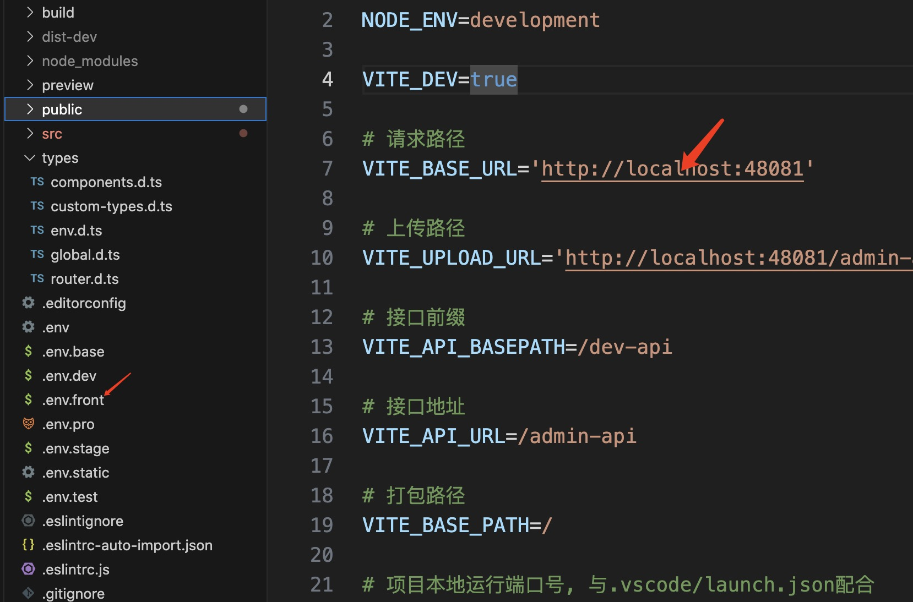
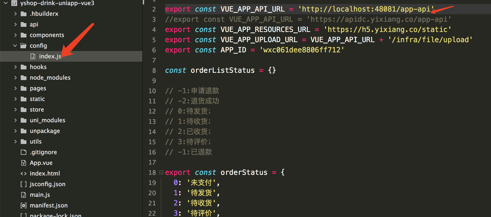
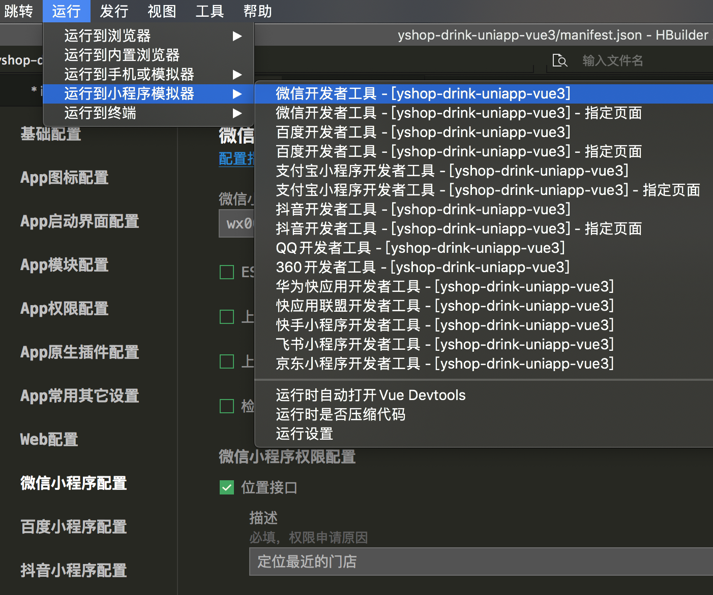
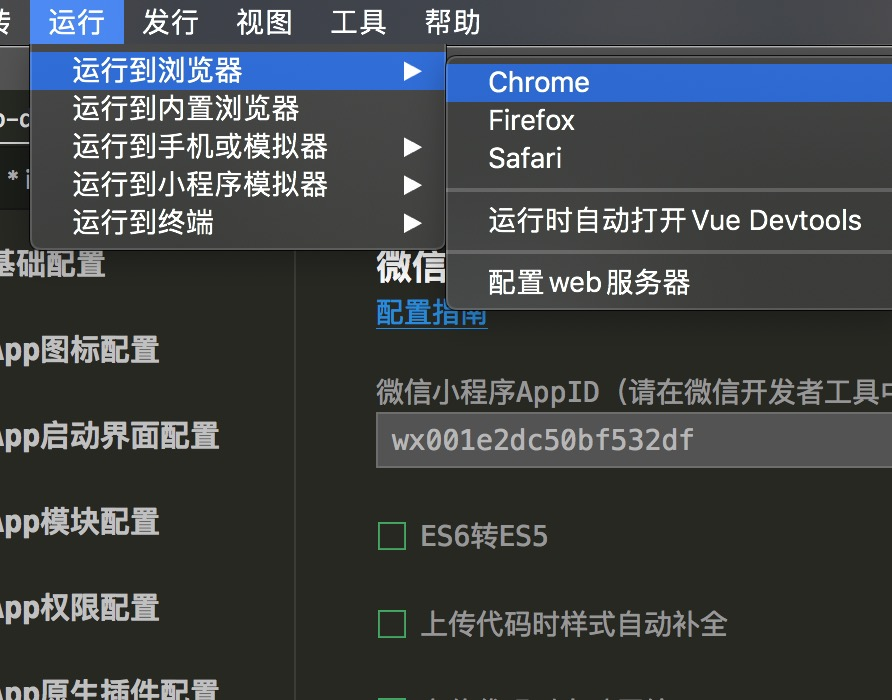
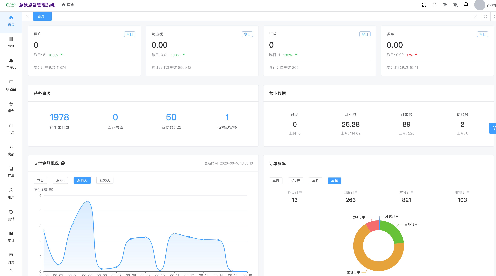
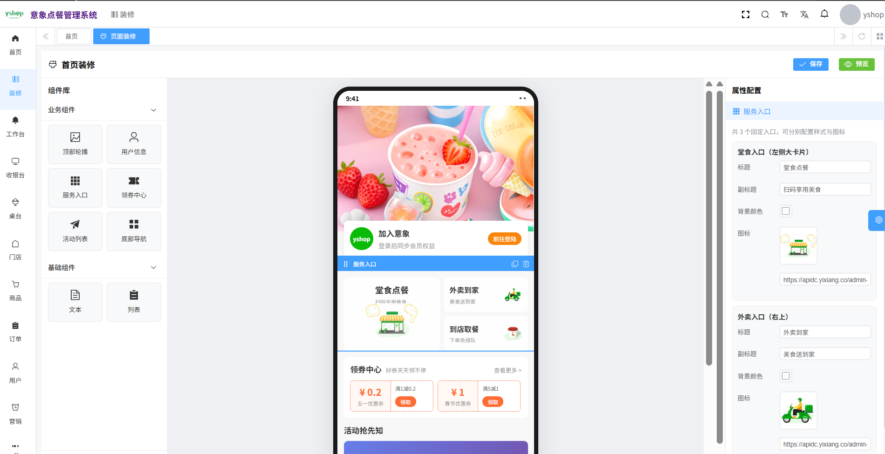
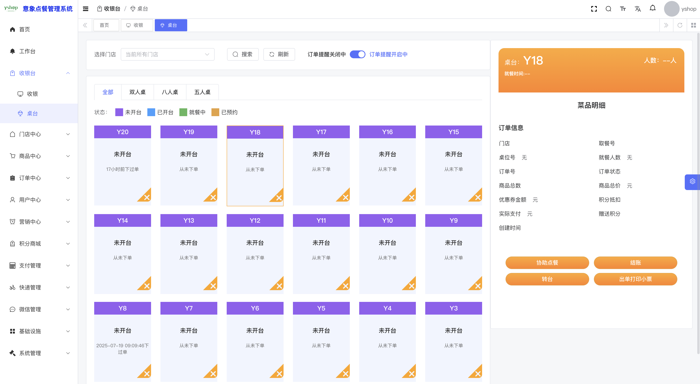
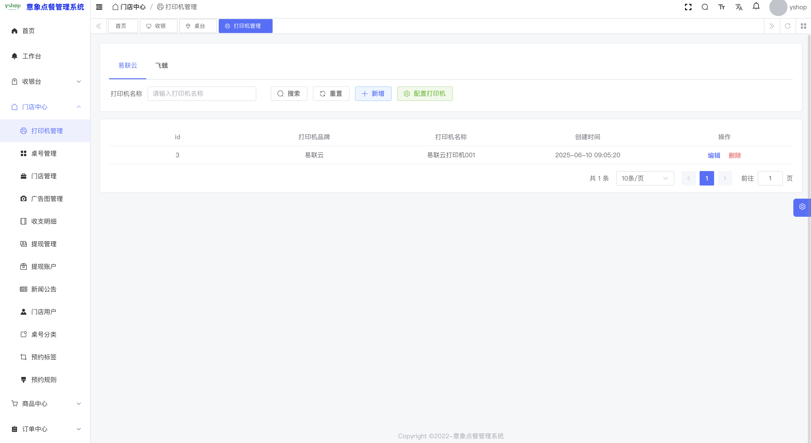
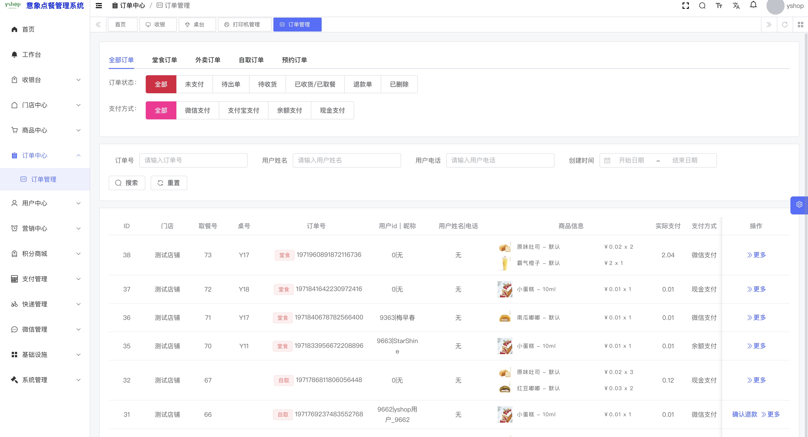

# 意象点餐 · yshop-drink

在线点餐（堂食扫码 / 外卖 / 自取）系统，支持多门店、SaaS 多租户、桌台扫码点餐。  
技术栈：Java 17 · Spring Boot 3 · Vue 3 · UniApp（H5 / 微信小程序）

[官网](https://www.yixiang.co/) · [开源协议 MIT](#开源协议)

---

## 目录

- [平台简介](#平台简介)
- [演示地址](#演示地址)
- [视频与交流](#视频与交流)
- [项目结构](#项目结构)
- [本地快速启动](#本地快速启动)
- [界面预览](#界面预览)
- [技术栈](#技术栈)
- [特别鸣谢](#特别鸣谢)
- [开源协议](#开源协议)

---

## 平台简介

前后端分离的扫码点餐系统，基于 Spring Boot 3、Spring Security OAuth2、MyBatis-Plus、Redis、JWT、Vue 3、UniApp 构建，适合企业或个人二次开发。

### 核心功能

| 模块 | 能力 |
|------|------|
| 点餐 | 外卖 / 自取、提前预约、桌台扫码（单人 / 多人协同） |
| 商品 | 多规格 SKU、图片素材库 |
| 门店 | 多门店、店铺管理、商家中心 |
| 营销 | 优惠券、积分兑换（积分 + 金额）、充值、会员卡 |
| 收银 | 收银台（扫码枪 / 扫码盒子）、云小票打印 |
| 运营 | 订单管理、微信公众号、自定义装修、SaaS 多租户 |

---

## 演示地址

| 端 | 地址 | 账号 |
|----|------|------|
| 后台管理 | https://dc.yixiang.co | `admin` / `admin123` |
| 门店端 | https://dc.yixiang.co | `yixiang001` / `123456789` |
| 移动端 | 关注公众号 → 菜单「其他系统」体验小程序 / H5 | 验证码登录默认：`9999` |

<p align="center">
  
</p>

---

## 视频与交流

如果项目对你有帮助，欢迎点右上角 **Star**，这是我们持续免费更新的动力。

- **QQ 交流群**：`544263002`（入群前请先 Star）
- 群内提供视频教程与开发文档

---

## 项目结构

```
yshop-drink/                 # Java 后端工程（本仓库）
yshop-drink-vue              # 后台管理（Vue 3）
yshop-drink-uniapp-vue3      # 移动端（UniApp Vue3，支持微信小程序 / H5）
```

---

## 本地快速启动

### 1. 环境要求

| 依赖 | 版本 |
|------|------|
| JDK | 17 |
| MySQL | 8 |
| Redis | 6+ |
| Node.js | 16+ |
| Maven | 3.8+ |

### 2. 开发工具

- **IDEA** — 后端
- **VS Code** — 后台前端
- **HBuilderX** — UniApp 移动端

### 3. 后端启动

1. 用 IDEA 打开 Java 工程，等待依赖自动安装  
2. 创建数据库，导入工程目录下 `sql/yixiang-drink.sql`  
3. 修改 `yshop-server` 中的 yml，配置数据库与 Redis：

   

4. 在工程根目录执行：

   ```bash
   mvn clean install package -Dmaven.test.skip=true
   ```

5. 启动项目：

   

### 4. 后台 Vue 启动

1. 用 VS Code 打开 Vue 工程，安装依赖：

   ```bash
   pnpm install
   ```

2. 配置 API 地址：

   

3. 本地启动：

   ```bash
   npm run dev
   ```

### 5. 移动端 UniApp 启动

1. 用 HBuilderX 导入 UniApp 项目  
2. 配置 API：

   

3. 配置小程序：

   

4. 运行微信小程序：

   

5. 运行 H5：

   

---

## 界面预览

### 小程序截图

| | |
|:---:|:---:|
|  |  |
|  |  |
|  |  |

### 后台截图

| | |
|:---:|:---:|
|  |  |
|  |  |
|  |  |

<p align="center">
  
  
</p>

<p align="center">
  
</p>

---

## 技术栈

**后端**

- Spring Boot 3
- Spring Security OAuth2
- MyBatis / MyBatis-Plus
- Redis
- Lombok / Hutool

**前端**

- Vue 3
- Element Plus
- UniApp（Vue 3）

---

## 特别鸣谢

- [ruoyi-vue-pro](https://gitee.com/zhijiantianya/ruoyi-vue-pro)
- [Element Plus](https://element-plus.gitee.io/zh-CN/)
- [Vue](https://cn.vuejs.org/)
- [pay-java-parent](https://gitee.com/egzosn/pay-java-parent)
- [uvui](https://www.uvui.cn/)
- [UniApp](https://uniapp.dcloud.net.cn/)

---

## 开源协议

本项目采用比 Apache 2.0 更宽松的 [MIT License](https://gitee.com/guchengwuyue/yshop-drink/blob/master/LICENSE) 开源协议。  
个人与企业可 **100% 免费使用**，无需保留类作者、Copyright 信息。
